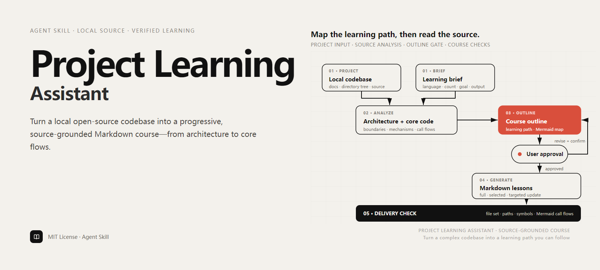

# Project Learning Assistant

[English](README.md) | [简体中文](README.zh-CN.md)



Project Learning Assistant is a Agent skill that turns a local open-source codebase into a progressive Markdown course focused on architecture, core mechanisms, and source-code reading paths.

> [!CAUTION]
> **This skill can consume a very large number of tokens.**
>
> It must inspect project documentation and source code, design a project-specific outline, and write several detailed lessons. Large repositories, broad learning goals, and 8–10 lesson courses can consume a substantial portion of your available token or usage budget. Review the outline carefully before approving it, and use a narrower scope or fewer lessons when appropriate.

## What it does

- Analyzes the actual files in a local project rather than relying on a remote repository description.
- Clarifies the project path, course language, lesson count, learning goal, and output directory.
- Recommends 3–10 lessons based on the project's observed size and complexity.
- Honors user-specified lesson counts outside 3–10; only the default recommendation is limited to that range.
- Defaults to understanding the architecture and core source code without deployment or execution.
- Creates a progressive course outline and, when lesson generation is requested, waits for explicit approval.
- Generates every approved lesson, only selected lessons, or a targeted update according to the requested mode.
- Generates a Mermaid architecture or component-relationship diagram from the local project structure.
- Generates Mermaid call-flow diagrams for lessons that explain representative core source flows.
- Verifies referenced paths, important symbols, and key call or data-flow relationships against the local source.
- Distinguishes source-backed facts from interpretation and unknown information.
- Never overwrites, deletes, or clears existing user files.
- Supports outline-only generation, selected lessons, and targeted updates to an existing lesson.

## Token usage

This is intentionally a token-intensive skill. Token consumption grows with:

- repository size and number of modules;
- the breadth of the learning goal;
- the requested number of lessons;
- the amount of core source code and cross-module behavior that must be explained;
- the number and complexity of evidence-grounded Mermaid diagrams;
- regeneration after outline or course changes.

To reduce token usage:

1. Point the skill at the smallest relevant local project or module.
2. Choose 3–5 lessons for an initial overview.
3. Use the default architecture-and-core-source learning goal instead of requesting exhaustive coverage.
4. Review the outline carefully before confirming it.
5. Revise individual lessons instead of regenerating the entire course.

After outline approval, the skill assumes the local source remains unchanged. It does not repeat the preliminary survey, full-project analysis, version check, or worktree check. It reads only the source files needed to author and verify each lesson.

## How it works

### 1. Clarify and analyze

The skill resolves five inputs:

- local project directory;
- course language;
- lesson count;
- learning goal;
- output directory.

It then studies the local documentation, module structure, core concepts, source entry points, and representative cross-module flows.

### 2. Generate the outline

The skill creates only the course outline, records the local project version and worktree state, and adds a Mermaid architecture or component-relationship diagram. It asks you to approve or revise the outline when lesson generation is requested; outline-only mode stops here.

No lesson files are created before approval.

### 3. Generate the lessons

After explicit outline approval, the skill generates every lesson or only the selected lessons, according to the request. It can also update one existing lesson without regenerating the course. Each lesson begins with learning objectives, explains the relevant concepts and mechanisms, provides a verified source-reading route, discusses supported design tradeoffs, and ends with reflection questions. Lessons covering representative core flows also contain Mermaid call-flow diagrams.

## Installation

Place this repository in your Codex skills directory under the name `project-learning-assistant`.

Typical locations:

```text
# Windows
C:\Users\<username>\.codex\skills\project-learning-assistant

# macOS or Linux
~/.codex/skills/project-learning-assistant
```

The installed directory must contain `SKILL.md`, `agents/`, and `references/`.

## Usage

Invoke the skill with `$project-learning-assistant` and provide a local project path.

```text
Use $project-learning-assistant to create a Chinese course for
D:\code\langchain4j. Focus on architecture and core source code.
```

You may also specify the lesson count and output directory:

```text
Use $project-learning-assistant to create an 8-lesson English course for
D:\code\deepseek-harness and save it to D:\notes\deepseek-harness-course.
```

If some preferences are missing, the skill recommends values and asks you to confirm them.

You can also request a partial output:

```text
Use $project-learning-assistant to generate only the outline for D:\code\langchain4j.

Use $project-learning-assistant to generate lessons 03 and 05 from the confirmed outline.

Use $project-learning-assistant to update only lesson 04 with a clearer source walkthrough.
```

## Output

A confirmed 5-lesson course may look like this:

```text
<project-name>-course/
├── 00_course-outline.md
├── 01_project-purpose-and-mental-model.md
├── 02_architecture-and-module-boundaries.md
├── 03_core-mechanisms.md
├── 04_core-source-walkthrough.md
└── 05_end-to-end-flow.md
```

Course filenames and content use the confirmed course language. Code identifiers and project-relative source paths remain unchanged.

## Important boundaries

- The project must already exist locally. A GitHub or other remote repository URL is not enough.
- The skill does not clone or analyze a remote repository as a substitute for local files.
- Deployment and execution are excluded by default.
- The skill does not generate lesson placeholders before outline approval.
- If the output directory is non-empty, the skill asks before writing unless the request explicitly targets an existing lesson or selected lessons in an existing course.
- A missing output directory is created automatically after its location is confirmed.
- A non-Git project with no discoverable version is marked as version unknown without creating a separate snapshot identifier.
- The skill supports automatic discovery as well as explicit `$project-learning-assistant` invocation.
- Mermaid diagrams support the written explanations and never replace source walkthroughs.
- Project-specific Mermaid nodes and edges must be verifiable from the local project.

## Project structure

```text
project-learning-assistant/
├── SKILL.md
├── agents/
│   └── openai.yaml
├── references/
│   ├── intake-and-analysis.md
│   ├── course-authoring.md
│   └── validation.md
└── docs/
    └── design/
        └── open-source-project-learning-skill-requirements.md
```

## License

[MIT](LICENSE)
